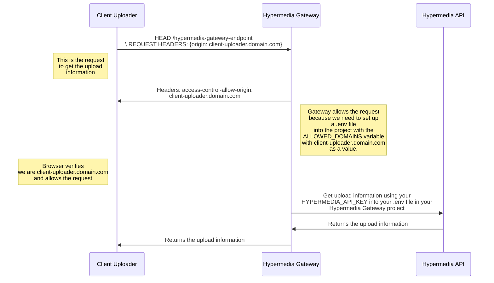

# <center>Hypermedia Gateway</center>


Welcome to Hypermedia Gateway, this is a server that allows you to upload files to the Hypermedia API.

- Why use Hypermedia Gateway?
- What contains?
- How it is works?
- Installation
    - Using Vercel (Recommended)
    - Self hosted

# Why use Hypermedia Gateway?
The main reason to use Hypermedia Gateway is to avoid exposing your API key to your clients, this is a security measure to avoid that your API key is exposed to the public.

Another reason is to avoid CORS problems, Hypermedia Gateway allows you to set up a list of allowed domains to get the upload information. This is a security measure to avoid that anyone can push files to your Hypermedia account.

**We recommend using Hypermedia Gateway in PRODUCTION environments.**

If you are using Hypermedia Gateway in development environments, please be sure to add `localhost:[PORT]` to the list of allowed domains.

# What contains?
The repo contains 2 endpoints: `/api/upload-information` and `/api/upload-completed`.

- **upload-information**: This endpoint is used to get the upload information from the Hypermedia API, this is the information that you need to upload files using the [TUS Protocol](https://tus.io/).

- **upload-completed**: This endpoint is used to notify to the Hypermedia API that the upload has been completed, this is necessary to save the file already uploaded into our database and link it with your account.

# How it is works?
Here you can see a diagram of how it works:




# Installation
First of all we need to do a Fork of this repo into your own github account, this is necessary to deploy the server using Vercel. If you don't want to use Vercel, you can deploy the server using any other service.

### How to fork this repo and get updates from the original repo?
1.  Fork this repo into your own github account
2.  Clone your forked repo into your local machine
3.  Add the original repo as a remote repo
    ```bash
    git remote add upstream
    ```
4.  Verify that the original repo has been added as a remote repo
    ```bash
    git remote -v
    ```
5.  Fetch the original repo
    ```bash
    git fetch upstream
    ```
6.  Merge the original repo into your forked repo
    ```bash
    git merge upstream/main
    ```
7.  Push the changes to your forked repo
    ```bash
    git push origin main
    ```
8.  Verify that the changes have been pushed to your forked repo
    ```bash
    git log
    ```
9.  Now you can deploy your forked repo using Vercel


## Using Vercel (Recommended)
For this installation we will have 2 ways to do it, the first one with a button to do it directly using the vercel dashboard or the second one using the Vercel CLI.

1.  Click on the following button:
    [](https://vercel.com/new)

2.  Select your forked repo
    

3.  Finish the whole deployment process in Vercel and then copy the public url from here . 

This is the URL that you need to paste into [@hypermedialabs/uploader](https://github.com/hypermedialabs/uploader).

### Environment Variables

After deploying the server using Vercel, you need to set up the following environment variables:

- `HYPERMEDIA_API_KEY`: Your API key for Hypermedia services. can be created in [Hypermedia Access Keys Section](https://hypermedia.link/account/accesskeys)
- `ALLOWED_DOMAINS`: A comma-separated list of allowed domains authorized to get the upload information. For example: ["https://my.domain.com"]..

 Go to `Settings -> Environment Variables` Variables and add the variables that we mentioned before.
    


**Please do not add `localhost` domains in production environments.**

### Returning to the client

At this point your server is ready to return to your client the necessary information to upload files using the [TUS Protocol](https://tus.io/).

Now just go to your client and using the [@hypermedialabs/uploader](https://github.com/hypermedialabs/uploader) library paste the URL generated by vercel into the code.

## Self hosted
Self host is allowed but make sure to follow the next steps:

1.  Clone this repo into your local machine
2.  Install the dependencies
    ```bash
    npm install
    ```
3.  Create a `.env` file in the root of the project and add the variables that we mentioned before.